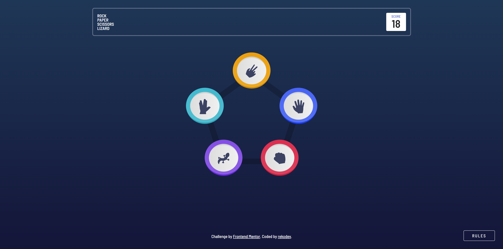

# Frontend Mentor - Rock, Paper, Scissors solution

This is a solution to the [Rock, Paper, Scissors challenge on Frontend Mentor](https://www.frontendmentor.io/challenges/rock-paper-scissors-game-pTgwgvgH). Frontend Mentor challenges help you improve your coding skills by building realistic projects.

## Table of contents

- [Overview](#overview)
  - [The challenge](#the-challenge)
  - [Screenshot](#screenshot)
  - [Links](#links)
- [My process](#my-process)
  - [Built with](#built-with)
  - [What I learned](#what-i-learned)
  - [Continued development](#continued-development)
  - [Useful resources](#useful-resources)
- [Author](#author)

## Overview

### The challenge

Users should be able to:

- View the optimal layout for the game depending on their device's screen size
- Play Rock, Paper, Scissors against the computer
- Maintain the state of the score after refreshing the browser _(optional)_
- **Bonus**: Play Rock, Paper, Scissors, Lizard, Spock against the computer _(optional)_

### Screenshot

### Links

- Live Site URL: [GitHub Pages](https://your-live-site-url.com)

## My process

### Built with

- CSS custom properties
- Flexbox
- CSS Grid
- Mobile-first workflow
- [React](https://reactjs.org/) - JS library
- [Styled Components](https://styled-components.com/) - For styles
- [Material UI]() - For components such as Modal, Card, Button etc.

**Note: These are just examples. Delete this note and replace the list above with your own choices**

### What I learned

I learned how to use the useContext hook, as well as custom styling MUI components using styled-components.

Overall this gave me a lot of needed practice working with React, especially using various hooks such as useState and useEffect, as well as practice styling using CSS in JS (using Styled Components). I've also gained a better understanding on how to utilize the Material UI library.

### Continued development

I am still struggling with responsive styling, especially when it comes to medium screen sizes (laptops, tablets), so I'm going to continue practicing and researching on how to implement the best practices.

Also, I'm thinking that I need more practice on determining when I should use the useState or useEffect hooks and when I can go on without them.

### Useful resources

- [React Documentation](https://react.dev/reference/react/useContext) - This helped me immensely in understanding how to use the useContext hook. I'm glad a hook like this exists so I don't have to rely on a third party library.

## Author

- Portfolio - [rekodev](https://portfolio-rekodev.vercel.app/)
- Github - [rekodev](https://github.com/rekodev)
